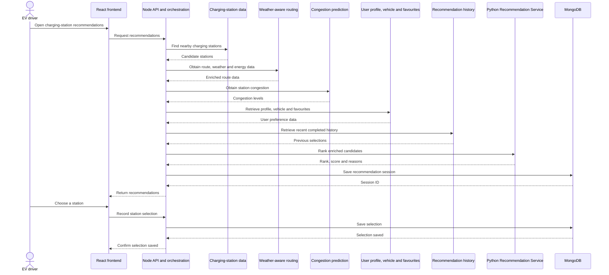

# Charging Station Recommendation System Documentation

## 1. Feature Overview

### 1.1 What the recommendation system does

The Charging Station Recommendation System helps an EV driver choose a suitable charging station near their current location. Rather than presenting nearby stations in an arbitrary order, it filters stations that are not suitable and ranks the remaining options using enriched route, energy, weather, traffic, station, and payment data. When the trained preference model is available, it provides the global ranking score; otherwise, the system uses its heuristic fallback. Where sufficient completed history exists, the ranking is also adjusted to reflect the user's past station selections.

For every recommendation, the user sees a station rank and short human-readable reasons. For example, a highly ranked station may show the reasons **Low station congestion**, **Low energy required to reach**, and **Nearby station**. This makes the recommendation understandable rather than presenting an unexplained ranking.

The system also records the ranked stations shown to the user as a recommendation session. If the user selects a station, the selection is saved. These completed sessions can later be used to personalise recommendations using observed user choices.

### 1.2 End-to-end feature flow

1. The frontend obtains the user's current latitude and longitude.
2. The frontend sends `POST /api/charger-recommendations` to the Node API. The route is protected by JWT authentication, so the user identity is taken from the verified token rather than from the request body.
3. The Node API finds nearby charging stations and enriches each candidate with routing, weather, energy, congestion, user profile, vehicle, favourite-station, and recent recommendation-history information.
4. The Node API sends the enriched candidates to the Python Recommendation Service at `POST /charging-station-recommendations/rank`.
5. The Recommendation Service filters ineligible stations, scores the remaining stations, sorts them in descending score order, assigns ranks, and produces explanation reasons.
6. The Node API merges each returned rank, score, and reason list back onto the station information. It then saves a recommendation-session snapshot in MongoDB before returning the result to the frontend.
7. The frontend displays the ranked station cards and the user chooses a station.
8. The frontend sends `POST /api/charger-recommendations/:sessionId/selection` with the chosen `stationId`. After the selection is saved successfully, the frontend can open Google Maps for navigation.

### 1.3 System flow and architecture



The recommendation endpoint is part of EVAT's combined Python FastAPI application (`server/python-services/main.py`) and is normally available on port 5000 during local development. The Node API is responsible for public endpoints and data orchestration; the Python Recommendation Service is responsible only for eligibility filtering, ranking, and explanation output.

### 1.4 Current status

The Charging Station Recommendation feature is complete and integrated across the React frontend, Node API, MongoDB persistence layer, and Python Recommendation Service.

- The Python endpoint `POST /charging-station-recommendations/rank` is integrated into the combined FastAPI application.
- The service filters ineligible candidates, ranks eligible stations with the exported personalised-preference model when available, and returns a rank, score, and explanation reasons for each recommendation.
- Recommendation sessions are saved before recommendations are returned to the frontend, and the user's final station selection is captured in MongoDB.
- The frontend supports requesting recommendations, displaying ranked station cards, recording a station selection, and opening navigation after the selection is saved.
- Empty results and missing optional route or energy values are handled safely, without preventing the recommendation flow from completing.

The trained preference model predicts the likelihood that a user will select each eligible station. Where sufficient completed selection history exists, the service applies a small user-specific personalisation adjustment. The heuristic scorer remains as resilience behaviour if model loading or inference fails, and it supplies the factors used to produce explanation reasons.

---

## 2. Frontend

### 2.1 Implementation

The frontend adds the charging-station recommendation experience to the existing map rather than creating a separate page. The work is organised into focused React components and a dedicated service layer so recommendation behaviour is separated from the wider map code.

- `ChargingRecommendations.jsx` provides the recommendation panel and coordinates user interactions.
- `ChargingRecommendationCard.jsx` displays each recommendation in a consistent ranked-card layout.
- `ChargingRecommendations.css` provides feature-specific layout and styling.
- `chargingRecommendationService.js` keeps recommendation requests and station-selection requests separate from the UI components.
- `Map.jsx` integrates the recommendation panel into the existing map experience.

### 2.2 Recommendation UI and interaction

Recommendations are presented as ranked cards so users can compare stations rather than reading an unstructured list. Each card shows available station details, distance, cost, connection and charging information. Users can expand **Why recommend?** to inspect the explanation reasons without making every card permanently large.

The panel can be minimised or expanded to keep the map usable. Selecting a station first records the selection through the backend; after it is saved, the frontend opens the station location in Google Maps for navigation.

### 2.3 Location and map integration

The frontend obtains the driver's current location through browser geolocation, then requests recommendations for that location. The user flow is:

1. Obtain the user's current location.
2. Request and display ranked station recommendations.
3. Inspect station details and explanation reasons.
4. Select a station.
5. Save the selection and open the station location in Google Maps.

### 2.4 Frontend states

The interface handles the main states that can occur during the recommendation flow:

- loading while recommendations are being prepared;
- an empty state when no recommendations are available;
- an error state when the flow cannot be completed; and
- a location-permission error when browser geolocation is unavailable or denied.

### 2.5 Current status

The frontend recommendation interface is implemented and integrated into the EVAT map. It supports location-based requests, ranked recommendation cards, expandable reasons, panel minimise/expand behaviour, station selection, and Google Maps navigation after a successful selection save.

---

## 3. Backend API and Integration

### 3.1 API responsibilities

The Node API and orchestration layer sit between the frontend and the services that produce a recommendation. They find nearby charging stations, obtain user-profile and vehicle information, retrieve congestion and weather-aware routing data, build the request expected by the Python Recommendation Service, and merge the returned rank, score, and reasons back onto each station.

It exposes two authenticated frontend endpoints: `POST /api/charger-recommendations` generates ranked recommendations, while `POST /api/charger-recommendations/:sessionId/selection` records the station selected from a saved recommendation session.

See [Appendix A.1](#a1-node-api-generate-recommendations) and [Appendix A.2](#a2-node-api-record-station-selection) for their request and response contracts.

### 3.2 Request and response handling

The recommendation request accepts the user's latitude and longitude, plus an optional `radiusKm` that defaults to 10 km. The authenticated user ID is read from the verified JWT, not from the request body.

The response returns a generated `sessionId` and the ranked station results. A no-nearby-stations request is valid: it returns an empty recommendation list and still saves a recommendation session. When routing data is unavailable for a candidate, route values are returned as `null` with `routingAvailable: false`; the orchestration layer does not substitute a zero value that could incorrectly improve a station's rank.

### 3.3 Authentication and authorisation

Both endpoints use the existing `authGuard`. The backend derives the user ID from the verified JWT so a client cannot read or modify another user's recommendation session by supplying a different ID in the request body.

### 3.4 Recommendation-service integration

The orchestration layer is the only backend component that calls the Python ranking service. It sends the enriched candidates, user profile, and recommendation history to `POST /charging-station-recommendations/rank`, then maps the returned `stationId`, `rank`, `score`, and `reasons` back to the station information returned to the frontend.

If the ranking service returns an error, the backend returns the underlying error detail rather than replacing it with a generic failure. This makes integration issues easier to diagnose.

### 3.5 Current status

The API and orchestration layer is implemented and integrated. It returns ranked recommendations with scores and reasons, saves the recommendation session, and records the user's selected station.

---

## 4. Data Persistence and Recommendation History

### 4.1 Purpose and scope

The recommendation-history layer records each set of charging-station recommendations produced for a user and records the station selected later by that user. Completed sessions provide input to future ranking and training data for the personalised preference model.

A recommendation session is not a charging session. It represents a ranked choice presented to the user, not the start or completion of charging.

### 4.2 Data stored

Each MongoDB `RecommendationSession` document stores:

- the authenticated user's MongoDB ID;
- the latitude and longitude from which recommendations were requested;
- a snapshot of every ranked candidate station, including route, weather, congestion, rank, score, and explanation data;
- the selected station and selection time, when the user makes a choice; and
- automatically managed creation and update timestamps.

Candidates are embedded in the session document so the system preserves the values used when the recommendation was made, even if station data changes later. `userId`, `stationId`, and `selection.stationId` remain references to the existing `User` and `ChargingStation` records.

The history layer does not store the request radius, `generatedAt`, the vehicle or profile snapshot, or the orchestration-layer `routingAvailable` flag.

### 4.3 Recommendation-history schema

Each session has an ID, owner, request location, candidate snapshot, optional selection, and timestamps. Candidate snapshots contain station details, route and energy estimates, weather and congestion data, ranking values, and explanation reasons. Unknown optional data is retained as `null`; a no-results request is stored with an empty candidate list.

### 4.4 Read and write flow

#### 4.4.1 Creating history

`ChargerRecommendationService.getRecommendations` collects and enriches nearby candidates, then calls `RecommendationHistoryService.createSession`. The service validates the user ID, location, and candidates; converts the user ID to an `ObjectId`; sets both selection values to `null`; and asks the repository to save the document.

The returned ID is exposed to the frontend as `data.sessionId`. A no-results request is also persisted with an empty candidate array.

#### 4.4.2 Recording a selection

The authenticated client calls `POST /api/charger-recommendations/:sessionId/selection` with `stationId`. The history service validates the session ID, user ID, and station ID before calling `recordSelection()`, which updates the session with Mongoose `findByIdAndUpdate()` and advances `updatedAt`.

#### 4.4.3 Reading recent history

`getRecentSessions` validates the user ID and accepts a positive integer limit, defaulting to 10. The repository filters by `userId`, sorts by descending `createdAt`, and returns the requested number of sessions. This history is currently used by the recommendation orchestration layer; there is no client-facing history-listing endpoint.

### 4.5 Current status

The schema, repository, and service are implemented and connected to the authenticated recommendation routes. Recommendation generation writes populated and empty sessions, selection capture updates a session, and recent selected history is supplied to the ranker.

### 4.6 Known issues and limitations

- No compound `{ userId: 1, createdAt: -1 }` index is declared for the common user-history query.
- No retention, archival, deletion, or user-erasure policy exists for location and user-linked recommendation snapshots.
- Service-boundary validation does not explicitly check coordinate ranges, candidate IDs, ranks, scores, or finite numeric values before Mongoose validation.
- User and station IDs are checked for syntactic validity but referenced records are not checked for existence.
- A repeated selection request overwrites the previously selected station and timestamp.
- The history read limit has no upper bound.
- Invalid IDs, missing sessions, ownership failures, and invalid candidate selections currently reach the controller's general error handler instead of being mapped to `400`, `403`, or `404` responses.
- There is no explicit schema-version field or migration strategy for older candidate snapshots.

### 4.7 Related implementation files

- `charger-recommendation-service.ts` - assembles candidates, reads history, ranks, and creates sessions.
- `charger-recommendation-controller.ts` - handles HTTP requests and responses.
- `charger-recommendation-route.ts` - defines authenticated generation and selection routes.

---

## 5. Recommendation Service

### 5.1 Purpose and responsibility

The Recommendation Service is the Python component that converts enriched charging-station candidates into an ordered recommendation list. It does not obtain station, routing, weather, congestion, or profile data itself. Those data are collected and normalised by the Node API orchestration layer before the ranking request is made.

The service has four responsibilities:

1. Apply hard eligibility filters.
2. Calculate a model-backed score for every eligible station.
3. Sort stations, assign ranks, and resolve score ties deterministically.
4. Return concise explanations for the strongest positive ranking signals.

### 5.2 Candidate filtering

The current hard filters remove a candidate when any of the following applies:

| Rule | Behaviour |
| --- | --- |
| Station operational status | A station with `isOperational: false` is excluded. |
| Charging points | A station with a known `chargingPoints` value of `0` is excluded. A missing value is allowed because the data is unknown rather than confirmed unavailable. |
| Reachability | A station is excluded when `socWithContingencyPct` is known and exceeds the current fallback usable state of charge of 10%. |

`socWithContingencyPct` represents the estimated percentage of the reference EV battery required to reach the station, including contingency. It is not the driver's live battery percentage. Live battery state is not yet available in the EVAT profile or vehicle data, so the current implementation uses a 10% fallback threshold.

Unknown routing data does not automatically exclude a station. If `socWithContingencyPct` is `null`, the station remains eligible because the system does not treat missing data as proof that a station is unreachable.

### 5.3 Ranking and scoring logic

When available, the service ranks each eligible station using the exported Logistic Regression preference model. The model predicts the probability that the user will select each candidate; this probability is converted to a score out of 100. If the model is unavailable, the heuristic scorer supplies the ranking score instead.

For each candidate, the service prepares the following model features:

- Numerical features: distance, normal and traffic-adjusted travel duration, energy needed to reach the station, charging-point count, temperature, and wind speed.
- Categorical features: road-traffic condition, payment-at-location availability, and station operator.

The model preprocessing pipeline fills missing numerical values with the median, standardises numerical values, and one-hot encodes categorical values. Unseen categories are accepted safely, so a new operator or traffic-condition value does not prevent a recommendation from being returned.

When the user has at least three completed station selections, the service builds a lightweight preference profile from the stations that user previously selected. It compares each candidate with the user's historical distance, cost, charging-point count, operator, congestion level, and payment-at-location pattern. The final score gives 85% weight to the global model score and 15% to the user-specific preference score.

For users with fewer than three completed selections, the final score is the global model score without the personalisation adjustment. Candidates are sorted by final score in descending order; ties are resolved by `stationId` to ensure consistent results, and ranks begin at 1.

If the trained model cannot load or cannot return predictions, the service falls back to the existing heuristic scorer so that recommendations remain available. This fallback also supplies the factor information used to generate explanation reasons.

### 5.4 Explanation output

The service returns up to three short reasons for each recommended station. The reasons are generated from the heuristic factor analysis to make the recommendation understandable; they are not direct feature-attribution output from the Logistic Regression model.

- `Low station congestion`
- `Low energy required to reach`
- `Nearby station`
- `Lower traffic-adjusted travel time`
- `Favourite station`

Reasons are ordered by heuristic-factor importance. If no strong positive signal meets the explanation threshold, the service returns `Balanced recommendation factors`.

### 5.5 API contract

The full request and response contract is provided in [Appendix A.3](#a3-python-recommendation-service-rank-stations).

### 5.6 Current status

The Recommendation Service is complete and integrated with the EVAT Python API. It filters ineligible candidates, uses the trained preference model when available, applies user-specific personalisation when sufficient completed selection history exists, and returns a rank, score, and explanation reasons for each recommendation.

The service is resilient to unavailable model inference: the heuristic scorer preserves recommendation availability and supplies the factor information used for explanations.

### 5.7 Known issues and limitations

- The usable state-of-charge filter uses a fixed 10% fallback because live vehicle battery state is not currently available. It should be replaced with a resolved user-specific usable SOC when that data is supported.
- The trained model is based on a limited initial history dataset, so its predictions should be reviewed and retrained as more completed recommendation sessions are collected. The heuristic weights remain an engineering fallback rather than the primary score when the model is available.
- `cost` is the separate price field. The heuristic fallback extracts its first numeric value, so complex pricing formats, memberships, and time-based fees may not be represented accurately.
- Congestion is treated as a station-level busyness signal. It is not a guaranteed real-time count of free charging ports.
- The system does not currently estimate exact charging time because it lacks all required inputs, including reliable station charging power, vehicle charging acceptance rate, live battery state, battery capacity, and target state of charge.
- Recent recommendation history is used for per-user adjustment only after at least three completed selections. Users below that threshold receive the global model score without a history adjustment.

### 5.8 Related implementation files

- `server/python-services/main.py` - exposes the FastAPI ranking endpoint.
- `server/python-services/charging_station_recommendation_api/main.py` - coordinates filtering and ranking.
- `server/python-services/charging_station_recommendation_api/models/request.py` - request and candidate schema.
- `server/python-services/charging_station_recommendation_api/models/response.py` - response schema.
- `server/python-services/charging_station_recommendation_api/services/candidate_filters.py` - hard eligibility rules.
- `server/python-services/charging_station_recommendation_api/services/scoring.py` - heuristic fallback and explanation-factor calculation.
- `server/python-services/charging_station_recommendation_api/services/preference_model.py` - exported-model loading and selection-probability inference.
- `server/python-services/charging_station_recommendation_api/services/personalization.py` - per-user history adjustment.
- `server/python-services/charging_station_recommendation_api/services/reasons.py` - explanation generation.
- `server/python-services/charging_station_recommendation_api/services/ranking_service.py` - sorting, rank assignment, and response construction.
- `server/python-services/charging_station_recommendation_api/training/model_output/preference_model.joblib` - exported trained preference model loaded at runtime.

---

## 6. Personalised Recommendation Model

### 6.1 Purpose and learning objective

The Personalised Recommendation Model learns which charging-station characteristics are associated with a user's station selections. It treats the task as binary classification: the station selected from a recommendation session is labelled `1`, while every other candidate in that session is labelled `0`.

The model is trained from EVAT's own completed recommendation sessions rather than an external dataset. Each candidate snapshot becomes one training row, preserving the route, energy, weather, station, and payment information available when the recommendation was made.

### 6.2 Dataset construction and quality controls

`dataset_builder.py` reads `RecommendationSession` documents from MongoDB, creates the candidate-level labels, and saves the cleaned dataset as `training_dataset.csv`. A session is retained only when it has a recorded selection, candidate stations, a matching selected candidate, and exactly one positive label.

The builder excludes sessions without a selection or candidates, candidates without station IDs, duplicate candidates within a session, and snapshots where every candidate has zero or missing values for all core snapshot fields. Legitimate individual zero values, such as zero wind speed, are retained.

The initial cleaned dataset contains 35 valid recommendation sessions and 326 candidate rows: 35 selected candidates and 291 non-selected candidates. `data_quality_check.py` reports class distribution, missing and unknown values, duplicate session/station rows, label validity, suspicious zero-value snapshots, session sizes, and numeric feature summaries.

### 6.3 Features and preprocessing

The current model uses these features:

- Numerical: distance, normal and traffic-adjusted duration, energy needed to reach the station, charging-point count, temperature, and wind speed.
- Categorical: road-traffic condition, payment-at-location availability, and station operator.

Missing numerical values are imputed with the median and then standardised. Categorical values are normalised and one-hot encoded; unseen categories are safely ignored at inference time.

`cost` is excluded from the first model because approximately 68% of the initial candidate records do not contain a price value. `congestionLevel` is also excluded because all cleaned records currently contain `unknown`, so it has no useful variation for training.

### 6.4 Training and evaluation

The model is a Logistic Regression classifier with balanced class weights to account for the naturally imbalanced selected and non-selected labels. It requires at least 30 completed sessions before training.

The dataset is split by complete recommendation session with `GroupShuffleSplit`, preventing candidates from one session from appearing in both training and test data. The initial split used 26 training sessions (240 candidate rows) and 9 test sessions (86 candidate rows).

| Metric | Initial result |
| --- | ---: |
| Accuracy | 0.8256 |
| Precision | 0.3636 |
| Recall | 0.8889 |
| F1 score | 0.5161 |
| ROC-AUC | 0.8456 |

These are initial pipeline-validation results, not production-performance guarantees. The dataset contains only 35 positive user selections, so the model should be retrained and re-evaluated as completed recommendation history grows.

### 6.5 Current status and model outputs

Training exports a fitted preprocessing and Logistic Regression pipeline as `preference_model.joblib`, plus `preference_weights.json` containing model metadata, data-split counts, metrics, intercept, and learned coefficients. The exported pipeline is used by the runtime integration described in Section 7 when it can be loaded successfully.

### 6.6 Limitations

- The initial dataset is small and class-imbalanced, so its evaluation metrics should not be treated as stable production performance.
- The model cannot learn user preferences for cost or congestion until those fields are more complete and variable in recommendation-history data.
- The model learns from recorded station selections, not confirmed charging outcomes or explicit user ratings.
- Model performance and the minimum-session threshold should be reviewed as more completed sessions are collected.

### 6.7 Related implementation files

- `server/python-services/charging_station_recommendation_api/training/dataset_builder.py` - builds labelled data from recommendation history.
- `server/python-services/charging_station_recommendation_api/training/data_quality_check.py` - reports dataset quality checks.
- `server/python-services/charging_station_recommendation_api/training/preprocessing.py` - defines model features and preprocessing.
- `server/python-services/charging_station_recommendation_api/training/train_preference_model.py` - trains and evaluates the model.
- `server/python-services/charging_station_recommendation_api/training/model_output/preference_model.joblib` - fitted model pipeline.
- `server/python-services/charging_station_recommendation_api/training/model_output/preference_weights.json` - model metadata, metrics, and coefficients.

---

## 7. Model Integration and Personalisation

### 7.1 Overview

This layer turns the candidate stations for a request into a ranked, personalised recommendation list. Ranking occurs in three layers:

1. The fixed-weight heuristic always calculates an initial score and factor breakdown for explanation reasons.
2. The trained preference model replaces the heuristic score with a predicted selection probability when model inference is available.
3. Per-user personalisation applies a small adjustment to whichever global score was produced.

Each layer fails safely: if the trained model or personalisation data is unavailable, the pipeline uses the preceding score rather than failing the recommendation request.

### 7.2 Model loading

`preference_model.py` loads `training/model_output/preference_model.joblib` once at process startup. The artifact is a fitted scikit-learn pipeline containing imputation, scaling, encoding, and a classifier produced by the training pipeline.

Loading is wrapped in `try`/`except`. A missing or corrupt model file, or a scikit-learn version mismatch, results in `MODEL = None` instead of an API startup failure. `is_model_available()` reports whether loading succeeded.

### 7.3 Ranking integration

`ranking_service.rank_candidates()` coordinates the layers for one request:

1. `scoring.score_candidates()` calculates the fixed-weight heuristic and explanation-factor breakdown for every candidate.
2. `predict_selection_probability()` returns a model probability for each candidate, when the trained model is available. The probability multiplied by 100 replaces the heuristic score.
3. `apply_personalization()` adjusts the selected global score using the user's completed selection history.
4. Candidates are sorted by final score, with `stationId` used as a deterministic tie-breaker.

For inference, `predict_selection_probability()` builds feature rows using `safe_float`, `clean_text`, and `clean_pay_at_location`, then calls `model.predict_proba()`. These small cleaning functions are mirrored in the serving layer rather than imported from `training/dataset_builder.py`, because that training module connects to MongoDB during import and would otherwise make the API depend on a configured database connection just to reuse pure cleaning helpers.

### 7.4 Fallback logic

Two independent fallbacks keep the service available:

- If the model is missing, fails to load, or inference fails, `predict_selection_probability()` returns `None`. The ranking service retains the heuristic score without treating this as a request error.
- If the user has fewer than `MIN_SELECTIONS` completed selections, currently 3, `build_preference_profile()` returns `None` and `apply_personalization()` leaves the global score unchanged.

This means a fresh checkout without a model artifact, or a new user without history, still receives a functional ranked recommendation list.

### 7.5 User-specific personalisation

`personalization.py` builds a lightweight per-request preference profile from `RankChargingStationsRequest.userProfile.userHistory`. It does not train or persist data at runtime.

The profile uses only stations the user actually selected. Unselected sessions are ignored. From the selected stations, it calculates:

- average accepted distance, cost, and charging-point count; and
- the most common operator, congestion tolerance, and payment-at-location preference.

`_mode()` removes placeholder values such as `unknown`, `null`, and `n/a` before calculating the most common categorical value. This prevents missing-value placeholders from being treated as genuine user preferences.

`personalization_score()` returns a value from 0 to 1. Distance, cost, and charging points use a closeness score that decays to 0 at a configured scale. Operator, congestion, and payment-at-location values receive 1.0 for an exact match, 0.0 for a mismatch, or 0.5 when either value is unknown.

The final blend applies a 15% personalisation adjustment. The adjustment is deliberately small so the global ranking remains dominant while the order is nudged toward the user's observed preferences.

### 7.6 Current status

- The fixed-weight heuristic is stable and provides the default score and explanation factors.
- Trained preference-model integration is implemented end to end, including heuristic fallback when the model file is unavailable.
- Per-user personalisation is implemented for users with sufficient completed selection history.

### 7.7 Known issues and limitations

- `personalization_score()` uses an unweighted average across its six factors. The relative importance of factors such as operator preference has not yet been tuned against real usage data.
- The effect of the 0.15 personalisation adjustment has not been evaluated against user satisfaction or conversion; its appropriate weight still needs validation with usage data.
- The Trip Confidence Score prototype is intentionally not integrated into this ranking pipeline because it combines a different set of services and has not been reviewed as part of the recommendation model. It could be added as a future factor if needed.

---

## 8. Testing and Validation

### 8.1 Scope

Testing covers the charging-station recommendation flow across the frontend, Python Recommendation Service, and the Node API and MongoDB recommendation-history layer. Backend automated coverage verifies component behaviour and selected integration paths; frontend validation has been performed through browser-based user-flow testing.

### 8.2 Frontend browser testing

Frontend validation was performed in the browser against the user flow, including:

- browser location permission and location retrieval;
- recommendation results and individual card rendering;
- expanding and collapsing explanation reasons;
- minimising and expanding the recommendation panel;
- loading, empty, error, and location-permission states; and
- mock recommendation data where appropriate to exercise different UI states and layouts.

### 8.3 Recommendation-service tests

Python tests verify that the service:

- rejects non-operational, zero-point, and known-unreachable stations;
- retains stations when optional routing data is unavailable;
- returns an empty list when no eligible candidates remain;
- ranks a stronger candidate above a weaker one;
- returns ranked explanation reasons; and
- continues ranking when optional values such as duration and energy are missing.

Relevant test files:

- `server/python-services/charging_station_recommendation_api/tests/test_candidate_filters.py`
- `server/python-services/charging_station_recommendation_api/tests/test_ranking_service.py`

### 8.4 Recommendation-history tests

The Node API history layer has repository unit tests for create, find, recent-session, and selection updates; service unit tests for creation, authorisation, candidate checks, recent reads, and invalid input; and an in-memory MongoDB integration test for create, read, update, and recent-history retrieval.

Relevant test files:

- `server/node-api/test/services/recommendation-history-service.test.ts`
- `server/node-api/test/repositories/recommendation-history-repository.test.ts`
- `server/node-api/test/integration/recommendation-history.integration.ts`

### 8.5 Model-training tests

Training-pipeline tests verify invalid all-zero recommendation snapshots are excluded, valid snapshots are retained, categorical text cleaning works, payment-at-location values are normalised, and price text is parsed safely.

Relevant test file:

- `server/python-services/charging_station_recommendation_api/training/test_training_pipeline.py`

### 8.6 Personalisation tests

Dedicated automated tests for personalisation and model fallback are not yet included. They should cover no-history, below-threshold, strong-preference, model-available, and model-unavailable scenarios.

### 8.7 Validation status

The completed validation covers frontend browser interaction, candidate filtering, ranking order, explanation output, empty candidate lists, missing optional values, recommendation-history persistence, and station-selection capture. Dedicated model-fallback, personalisation, and end-to-end automated validation should be added when Section 6 is completed.

---

## Appendix A: API Contracts

### A.1 Node API: Generate recommendations

`POST /api/charger-recommendations`

This authenticated endpoint accepts the driver's current location. The user ID is taken from the JWT, not from the request body. `radiusKm` is optional and defaults to 10 km.

**Request body**

```json
{
  "latitude": -37.8136,
  "longitude": 144.9631,
  "radiusKm": 10
}
```

**Response body**

```json
{
  "message": "success",
  "data": {
    "sessionId": "recommendation-session-id",
    "recommendations": [
      {
        "stationId": "station-1",
        "latitude": -37.81,
        "longitude": 144.97,
        "operator": "Chargefox",
        "connectionType": "CCS2",
        "currentType": "DC",
        "chargingPoints": 4,
        "cost": "$0.45/kWh",
        "isOperational": true,
        "routingAvailable": true,
        "distanceKm": 1.2,
        "durationMin": 4.0,
        "durationInTrafficMin": 5.0,
        "congestionLevel": "low",
        "rank": 1,
        "score": 92.4,
        "reasons": ["Low station congestion", "Nearby station"]
      }
    ],
    "generatedAt": "2026-09-03T10:30:00.000Z"
  }
}
```

A valid request with no nearby stations returns the same response structure with an empty `recommendations` array.

### A.2 Node API: Record station selection

`POST /api/charger-recommendations/:sessionId/selection`

This authenticated endpoint records the station chosen from a recommendation session. The service verifies that the session belongs to the authenticated user and that the selected station was included in that session.

**Request body**

```json
{
  "stationId": "station-1"
}
```

**Response body**

```json
{
  "message": "Station selection saved successfully"
}
```

### A.3 Python Recommendation Service: Rank stations

#### Endpoint

`POST /charging-station-recommendations/rank`

The endpoint is exposed through the combined Python FastAPI service. The Node API calls it internally after enriching station candidates.

#### Request

The request includes the authenticated user ID, the requested location, the user profile, and one to ten enriched candidates. Candidate data includes the route, energy, weather, traffic, station, and payment fields required for model inference. `userHistory` contains completed recommendation sessions and is used for the user-specific adjustment when sufficient history exists.

```json
{
  "userId": "user-1",
  "userLocation": {
    "latitude": -37.8136,
    "longitude": 144.9631
  },
  "userProfile": {
    "vehicle": {
      "vehicleId": "vehicle-1"
    },
    "favouriteStationIds": ["station-1"],
    "userHistory": [
      {
        "candidates": [
          {
            "stationId": "station-previous",
            "latitude": -37.82,
            "longitude": 144.98,
            "isOperational": true,
            "chargingPoints": 2,
            "distanceKm": 2.4,
            "operator": "Chargefox",
            "payAtLocation": "yes",
            "congestionLevel": "medium",
            "rank": 1,
            "score": 81.5,
            "reasons": ["Nearby station"]
          }
        ],
        "selection": {
          "stationId": "station-previous",
          "selectedAt": "2026-09-03T10:30:00Z"
        }
      }
    ]
  },
  "candidates": [
    {
      "stationId": "station-1",
      "latitude": -37.81,
      "longitude": 144.97,
      "isOperational": true,
      "chargingPoints": 4,
      "operator": "Chargefox",
      "payAtLocation": "yes",
      "distanceKm": 1.2,
      "durationMin": 4.0,
      "durationInTrafficMin": 5.0,
      "energyNeededKwh": 0.6,
      "socWithContingencyPct": 6.0,
      "temperatureC": 18.0,
      "windSpeedMs": 3.5,
      "roadTrafficCondition": "moderate",
      "congestionLevel": "low"
    }
  ]
}
```

#### Response

```json
{
  "recommendations": [
    {
      "stationId": "station-1",
      "rank": 1,
      "score": 92.4,
      "reasons": [
        "Low station congestion",
        "Low energy required to reach",
        "Nearby station"
      ]
    }
  ]
}
```

The service returns only the ranking result. The Node API combines this result with the existing station data before returning station cards and the generated `sessionId` to the frontend.
